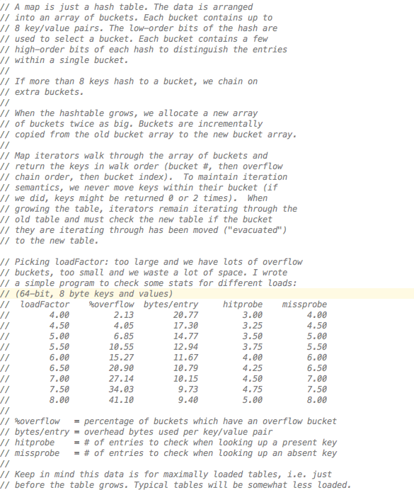

# Golang map实现

## 前言

golang在自己的内置类型中实现了hashmap这种数据结构，而且这个hashmap的key支持任意能计算hash值的数据类型，可以说是十分方便了。因此我在各种项目中都大量使用了这种数据结构，但是越是这种通用型的数据结构，想要在某个特定的场景中用好，却不是一件那么简单的事情，所以为了不给项目埋坑，深入了解hashmap的实现就是一件十分有必要的事情了。

## map基本原理

hashmap是一个十分常见也是十分经典的数据结构，而通常一个hashmap需要将key进行hash计算，然后映射到一个数组下标上，然后通过数组下标访问，达到O(1)时间复杂度快速访问，但是无论多美完美的hash算法，都会导致多个key的最后计算结果相同——即hash碰撞。而解决hash碰撞也有多种方法，比如退避法，拉链法等等。其中，拉链法是最为常见也是最为有效的方法，因此golang的hashmap也是采用的拉链法，但是golang在普通的拉链法上又做了许多性能上的优化。

## golang hashmap基本概念原理

golang的hashmap是由一个个的桶(bucket)组成，每个桶额定可以放8个元素，通过hash算法定位桶的下标，然后在每个桶中再进行查找，如果某个hash值的元素个数超过8，那么则在桶后面拉链处一个新桶（overflow buckets），用来装新数据。然后除此外，这里还有一个loadFactor的概念，即桶平均的装载率。桶的装载率直接影响了overflow buckets的数目和内存使用率，通过作者测试，当loadFactor在6.5的时候能达到最好的平衡。



## 数据结构

在上述数据结构中，最为重要的就是bmap这个数据结构了，也就是上文介绍的一个bucket。bmap包含了两部分，第一个部分是tophash这样一个数据结构，这个主要作为在bucket中进行快速定位的一种“filter”，然后再后面就是8个key和8个value的数据空间，这部分数据的访问全部通过地址pointor+下标偏移来完成。然后最后一个就是一个pointor，用来指向overflow的bucket数据。
## 详细介绍
上面简单介绍了golang hashmap的基本原理，那么下面就通过增删改查操作来详细介绍一下它的一些实现细节，并通过这个来指导我们平时自己的使用
### map初始化
map的初始化通过makemap方法实现，该方法会做一些合法性判断，然后如果传入了初始化大小，则会根据大小和loadFactor来创建对应数量的bucket
```
func overLoadFactor(count int64, B uint8) bool {
	// TODO: rewrite to use integer math and comparison?
	return count >= bucketCnt && float32(count) >= loadFactor*float32((uintptr(1)<<B))
}
```
如果没有传大小，那么只会初始化map的数据结构，而不会创建任何的bucket——lazy init。
