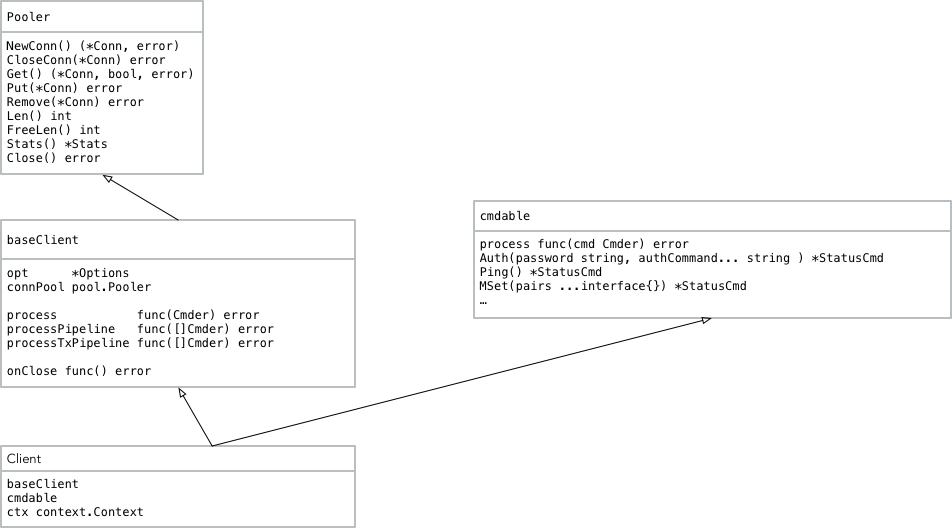

# 背景
因为inspector需要正式接入redis的秒级监控，在秒级监控场景下，如果redis driver的使用有任何不当，都有可能导致线上故障，所以特地了解了一下go-redis driver的具体实现：包括连接池实现方式，连接方式，失败重连机制，自动重连机制等。

# 主要struct结构




<div data-type="alignment" data-value="center" style="text-align: center;">
  <div data-type="p"> 图1.1 go-redis主要struct结构</div>
</div>

在go-redis driver中主要有上面四个struct/interface，而返回给用户使用的就是Client struct了。Client有两个比较重要的成员，一个是baseClient，还有一个是cmdable，其中前者维护了一个连接池对象以及基础执行方法：process——执行单命令，processPipeline——批量执行命令，processTxPipeline——事务批量执行命令，而后者则是一个拥有redis基础命令function的struct。因为采集只会用到单命令模式，所以后面只会讲到这个命令。
# 主要方法
### 初始化
go-redis初始化时采用的lazy init的方式，对于当new一个client后，并不会直接创建连接，而只是初始化相关的option属性，并返回一个没有任何连接的client
```go
func NewClient(opt *Options) *Client {
       opt.init()

       c := Client{
              baseClient: baseClient{
                     opt:      opt,
                     connPool: newConnPool(opt),
              },
       }
       c.baseClient.init()
       c.init()

       return &c
}
```
上面的newConnPool，c.baseClient.init和c.init方法都只是初始化需要的相关属性，不会有任何连接的建立。而newConnpool则是创建出对应的对象池队列：
```go
func NewConnPool(opt *Options) *ConnPool {
       p := &ConnPool{
              opt: opt,

              queue:     make(chan struct{}, opt.PoolSize),
              conns:     make([]*Conn, 0, opt.PoolSize),
              freeConns: make([]*Conn, 0, opt.PoolSize),
       }
       if opt.IdleTimeout > 0 && opt.IdleCheckFrequency > 0 {
              go p.reaper(opt.IdleCheckFrequency)
       }
       return p
}
```
我们可以看到，如果配置的idleTimeout或者idleCheckFrequncy参数，那么就会起一个协程，对空闲连接进行reap。在对于控制连接池大小上，这里使用了queue这个channel，这样就避免了对计数的原子比较和加减，也就避免了锁的使用。
### 执行操作
在执行操作的时候，Client会调用cmdable对象来执行对应的操作，而cmdable中的process对象则是来源于baseClient中的connpool
```go
func (c *cmdable) Ping() *StatusCmd {
       cmd := NewStatusCmd("ping")
       c.process(cmd)
       return cmd
}
```
通过这种方法，就将连接池和命令分离开来，这样也将常用的命令都封装在了一起。
### 如何获取链接
在每次真正执行操作之前，client都会调用connpool的Get方法，在这个Get方法中实现了链接的创建和获取。
```go
select {
	case p.queue <- struct{}{}:
	default:
		timer := timers.Get().(*time.Timer)
		timer.Reset(p.opt.PoolTimeout)

		select {
		case p.queue <- struct{}{}:
			if !timer.Stop() {
				<-timer.C
			}
			timers.Put(timer)
		case <-timer.C:
			timers.Put(timer)
			atomic.AddUint32(&p.stats.Timeouts, 1)
			return nil, false, ErrPoolTimeout
		}
	}
```
首先，这里会给connPool初始化时创建的channel发送一个信号，如果信号阻塞了，说明当前已经用满连接池的所有链接，那么此时会在timeout时间内，尝试继续发送信号，如果还是阻塞，则返回错误，否则即刻停止timer，进行后续操作。在这里有一个细节比较好，就是timer对象的对象池化，这样就不用频繁创建然后等gc去回收timer小对象了。不过这种优化必须在连接池被用满的情况下效果比较明显。
还有强调一点的就是，这里并不获取任何连接，这里获取的是接下来获取真正连接的“资格”。
当拿到获取链接的“资格”后，接下来便是去获取真正的链接
```go
for {
       p.freeConnsMu.Lock()
       cn := p.popFree()
       p.freeConnsMu.Unlock()

       if cn == nil {
              break
       }

       if cn.IsStale(p.opt.IdleTimeout) {
              p.CloseConn(cn)
              continue
       }

       atomic.AddUint32(&p.stats.Hits, 1)
       return cn, false, nil
}
```
这里先遍历Client中free conn数组，如果找到没有超过idleTimeout的链接，则返回，遍历期间，如果找到stale的conn，则会直接close掉。
这里面其实有个可以优化的地方，因为如果free队列里面的所有conn都是stale的，那么后面会需要重新new，而这里完全可以留下一个当做本次使用（因为这个idleTimeout只是客户端的timeout），然后批量关闭stale的，因为close操作实现加了锁，这样锁使用量会少。
### 如何创建连接
```go
opt.Dialer = func() (net.Conn, error) {
       conn, err := net.DialTimeout(opt.Network, opt.Addr, opt.DialTimeout)
       if opt.TLSConfig == nil || err != nil {
              return conn, err
       }
       t := tls.Client(conn, opt.TLSConfig)
       return t, t.Handshake()
}
```
创建连接，其实也就是创建了一个tcp连接
### 如何实现失败重连/自动重连
go-redis在每次执行命令失败以后，会判断当前失败类型，如果不是redis server的报错也不是设置网络timeout后的timeout报错，那么则会将该连接从连接池中remove掉，如果有设置重试次数，那么就会继续重试命令，又因为每次执行命令时会从连接池中获取链接，而没有又会新建，这样就变相实现了失败重连/自动重连机制。
```go
if internal.IsBadConn(err, false) {
       _ = c.connPool.Remove(cn)
       return false
}

_ = c.connPool.Put(cn)
return true
```
通过这种方式，初始化好一个redis client之后，便不用再关注重连逻辑了。

